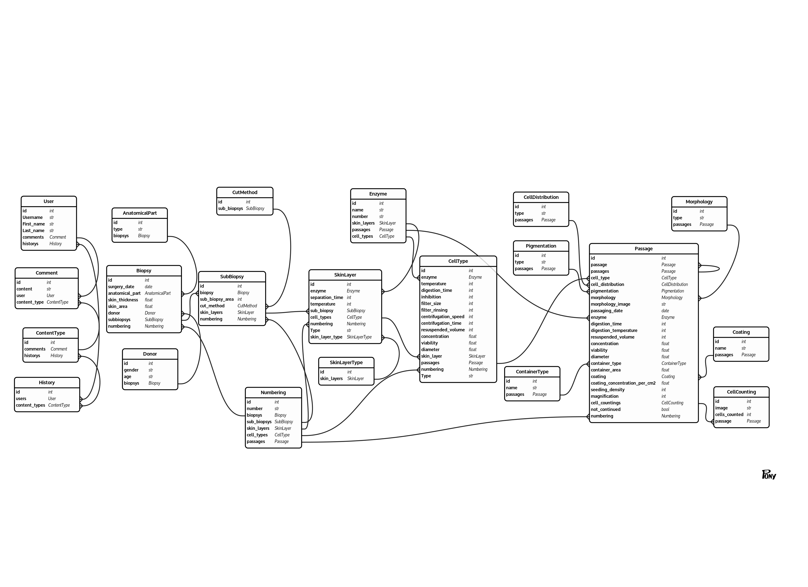
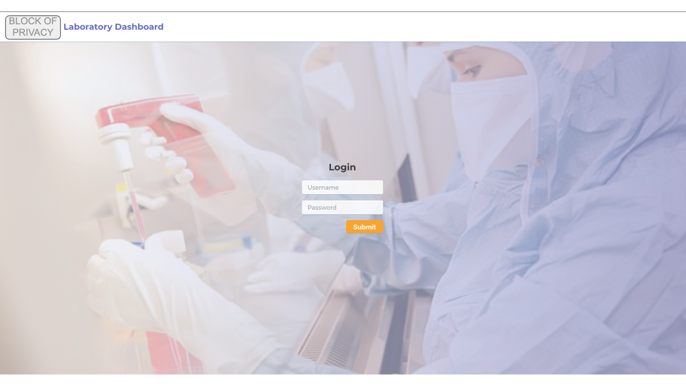
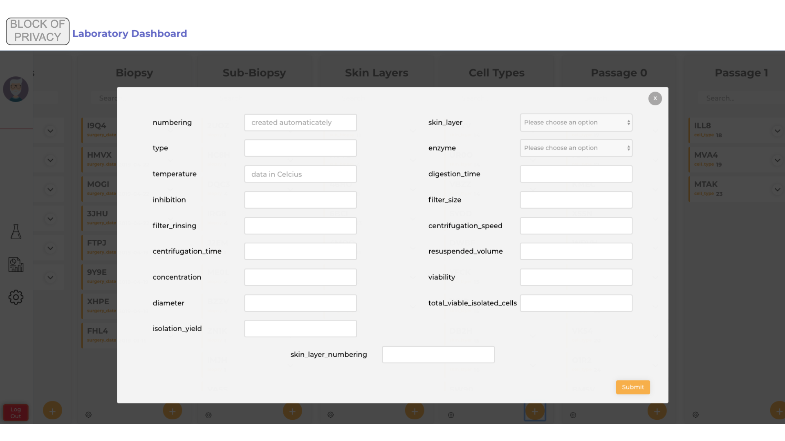
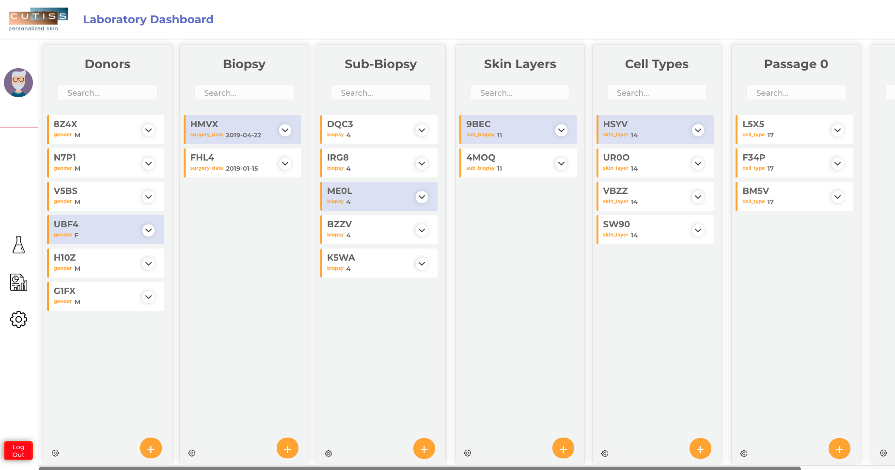
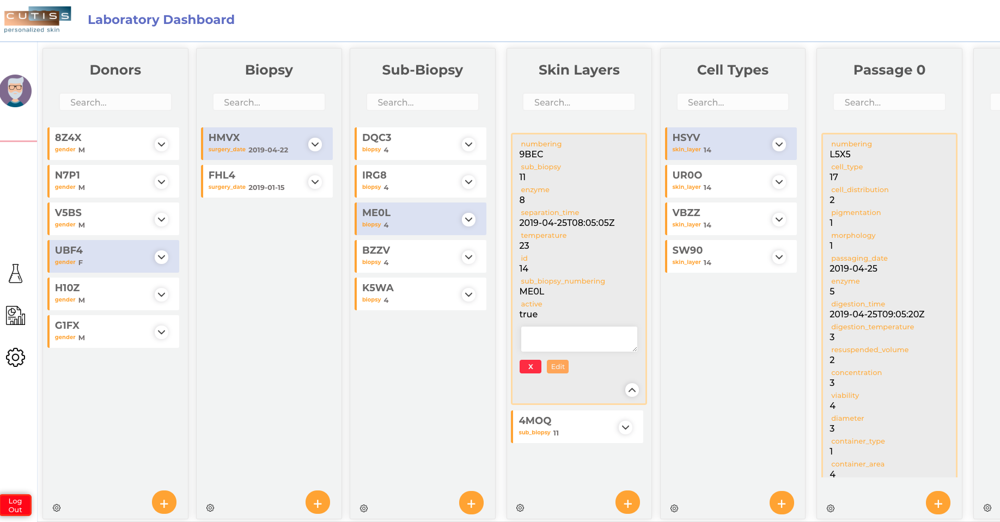
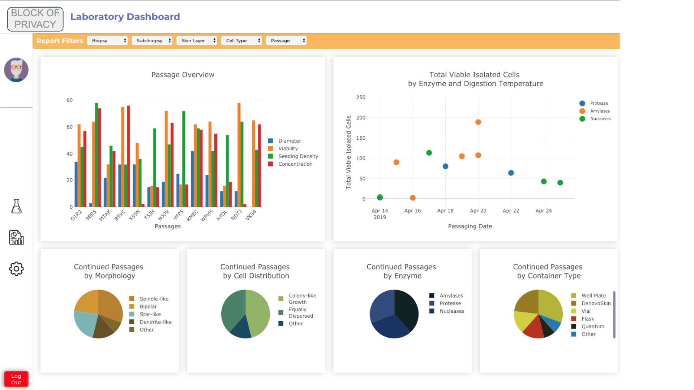

# Laboratory Dashboard
## What is it?
Web app built for a team of research scientists at a biotech company to log, edit, and analyze data from each step of their experiments.

## Why?
With each stage of their experiments, different data needs to be logged and tracked. Also, each entry is broken out into multiple entries in the next stage resulting in a massive amount of data needing organization, tracking, and analysis.

This was the final project for my [Full Stack Web Development Bootcamp](https://propulsion.academy/full-stack) at Propulsion Academy built out for a swiss biotech company.

## My contributions
I worked alongside 2 fellow students with the guidance of our instructors to build this app from scratch to the meet the company's needs.  

**I was primarily responsible for the following:**
- DevOps: Project setup, deployment, admin features, and API/database maintenance
- Backend: Models, serializers, and endpoint list
- Frontend: Reporting features, auto-logout functionality

## How does it work?

After logging in, the user can view, edit, or create data entries with preloaded fields for each experiment step.

- Each column represents a stage of the experiment and different data collection requirements.
- In the columns, entries are shown with their unique ids
- Clicking on individual entries displays and allows editing of the full data of the entry.
- User can add new entries or edit existing data

## Features
 - Search function for entries by ID
 - Filter function for all entries related to a parent entry
 - Data fields with automatic calculations based on entered data
 - Auto-generated unique ID based on lab reqiurements for new entries
 - Preloaded fields for data entries stemming off of existing data
 - Export function to download data in chosen format
 - Real-time filterable reporting interface showing key metrics
 - Full change history for compliance reasons

## Technology
- DevOps: Docker, Gitlab, CI/CD, Nginx
- Backend: Python, Django REST Framework, Postgres (API: LINK TO API DOC)
- Frontend: HTML, SCSS, JavaScript, React, Redux
- Plugins: React-Plotly, React-Idle-Timer, Django-Import-Export, Django-Simple-History

## Database Schema/Models

## Demo Screenshots

