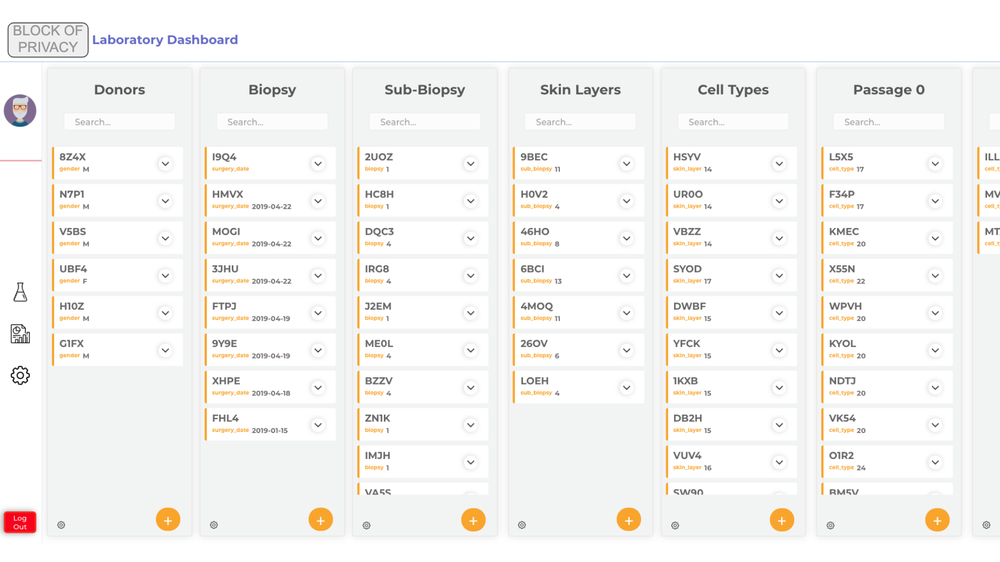
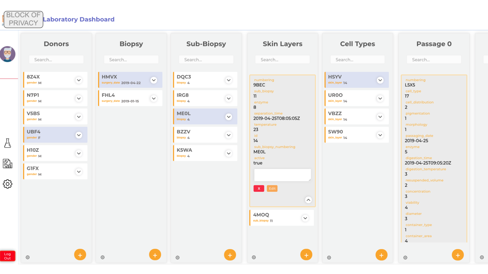

# Laboratory Dashboard
## What is it?
Web app built for a team of research scientists at a biotech company to log, edit, and analyze data from each step of their experiments.

## Why?
With each stage of their experiments, different data needs to be logged and tracked. Also, each entry is broken out into multiple entries in the next stage resulting in a massive amount of data needing organization, tracking, and analysis.

This was the final project for my [Full Stack Web Development Bootcamp](https://propulsion.academy/full-stack) at Propulsion Academy built out for a swiss biotech company.

## My contributions
I worked alongside 2 fellow students with the guidance of our instructors to build this app from scratch to the meet the company's needs. We assigned primary responsibilities to each team member, but also contributed to other sections (i.e. building out endpoints, writing actions for the frontend, etc.) as needed to complete the project in the 3 week timeline.

**I was primarily responsible for the following:**
- DevOps: Project setup(file structure, container setup, etc.), deployment, [admin features](https://github.com/etsyketsy/finalProject/blob/master/backend/project/project/api/admin.py), and API/database maintenance
- Backend: [Models](https://github.com/etsyketsy/finalProject/tree/master/backend/project/project/api/models), [serializers](https://github.com/etsyketsy/finalProject/tree/master/backend/project/project/api/Serializers), and [endpoint requirements](https://github.com/etsyketsy/finalProject/blob/master/backend/README.md)
- Frontend: [Reporting features](https://github.com/etsyketsy/finalProject/tree/master/frontend/frontend/src/components/Plots), auto-logout functionality

## How does it work?

After logging in, the user can view, edit, or create data entries with preloaded fields for each experiment step.

- Each column represents a stage of the experiment and different data collection requirements.
- In the columns, entries are shown with their unique ids
- Clicking on individual entries displays and allows editing of the full data of the entry.
- User can add new entries or edit existing data

## Features
 - Search function for entries by ID
 - Filter function for all entries related to a parent entry
 - Data fields with automatic calculations based on entered data
 - Auto-generated unique ID based on lab reqiurements for new entries
 - Preloaded fields for data entries stemming off of existing data
 - Export function to download data in chosen format
 - Real-time filterable reporting interface showing key metrics
 - Free comment field for certain data fields for additional information
 - Full change history for compliance reasons

## Technology
- DevOps: Docker, Gitlab, CI/CD, Nginx
- Backend: Python, Django REST Framework, Postgres (API: LINK TO API DOC)
- Frontend: HTML, SCSS, JavaScript, React, Redux
- Plugins: React-Plotly, React-Idle-Timer, Django-Import-Export, Django-Simple-History

## Database Schema/Models

## Demo Screenshots
### Login page

### Dashboard for existing data

### Creating a new entry

### Filtering based on parent entry

### Viewing entry details

### Reporting Interface
